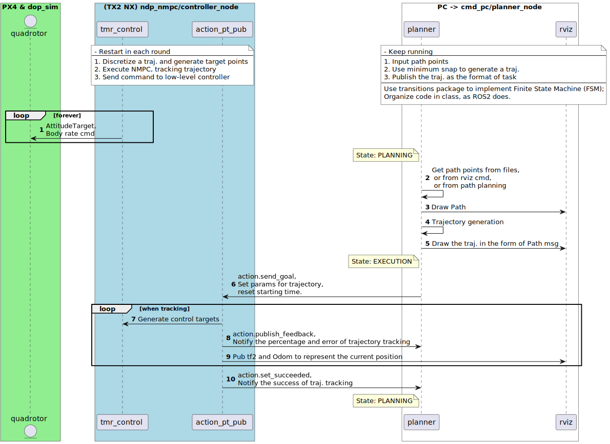

# NDP NMPC QD

NDP NMPC QD is a repository with three packages: cmd_pc, ndp_nmpc, and dop_sim.

The main package is ndp_nmpc, including an NMPC controller, a hover throttle estimator, and a downwash estimator. This repository receives traj. info (TrajCoefficients.msg) from cmd_pc (planner), and then sends bodyrate cmd (using mavros_msg) to dop_sim or any simulators or real quadrotors. Communication between packages leverages mavros as the comm interface.

Read our paper for more details: https://arxiv.org/abs/2304.07794.

## Citation

```
@INPROCEEDINGS{
  author={Li, Jinjie and Han, Liang and Yu, Haoyang and Lin, Yuheng and Li, Qingdong and Ren, Zhang},
  booktitle={62nd IEEE Conference on Decision and Control (CDC)},
  title={Nonlinear MPC for Quadrotors in Close-Proximity Flight with Neural Network Downwash Prediction},
  year={2023},
  pages={1-7}}
```

## Installation

1. install ROS noetic following http://wiki.ros.org/noetic/Installation/Ubuntu
2. install PyTorch with GPU option following https://pytorch.org/get-started/locally/
3. install acados following https://docs.acados.org/installation/index.html
4. Create a workspace for ROS noetic, then go to the /src
4. `sudo apt install ros-noetic-mavros-msgs`
5. `git clone --recurse-submodules https://github.com/Li-Jinjie/ndp_nmpc_qd.git`
6. `catkin build` to build the whole workspace. Done!

Done!

## Getting Started

Before each running:  `cd /path_to_workspace` and then `source devel/setup.bash`

- If you want to make one quadrotor fly, just run `roslaunch ndp_nmpc_qd one_qd_nmpc.launch`
- Then run `roslaunch cmd_pc send_traj.launch path_config_file:=eight_high_dyn.yaml ` to send a trajectory!

Instead,

- If you want to make three quadrotor fly in a formation, just run `roslaunch ndp_nmpc three_qd_nmpc_formation.launch`
- Then run `roslaunch cmd_pc send_traj.launch path_config_file:=eight_low.yaml` to send a trajectory!

If you want to see ndp_nmpc,

- `roslaunch ndp_nmpc three_qd_ndp_nmpc.launch`
- `roslaunch cmd_pc send_traj.launch path_config_file:=eight_low.yaml `

## Workflow



## License

GPLv3. Please also open-source your project if you use the code from this repository. Let's make the whole community better!
